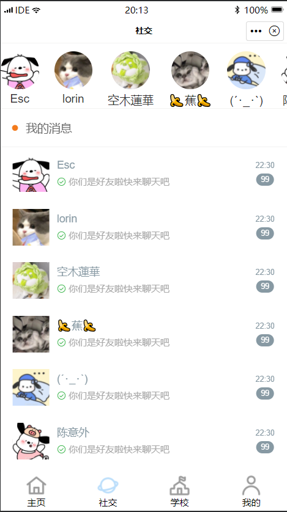
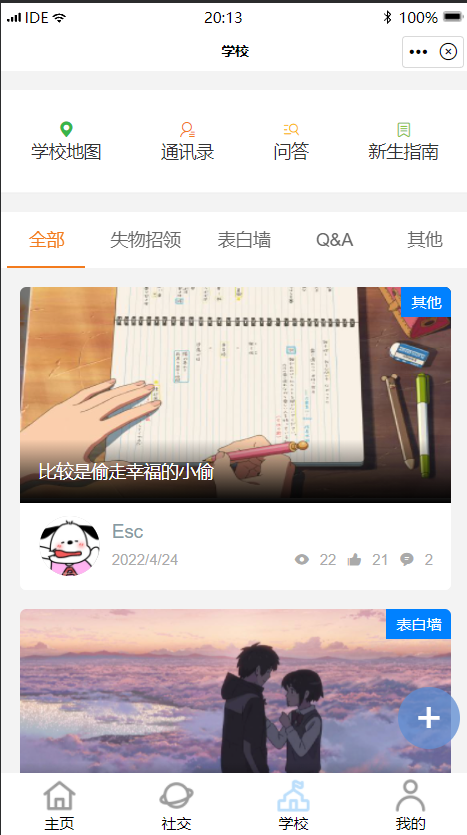

# 项目名称-校园Cosmos

# 团队名称-神级程序员重生之我在都市炒河粉

# 团队成员

队长： 叶婷婷
成员：李泽邦、李龙、陈崇标、邹昀昊

# 功能说明

## 主页板块

- 活动报名

组织活动报名填写表单权限、发布报名链接

- 活动签到

显示活动签到列表点击活动填写表单提交为签到成功

- 成绩查询

通过填写学号密码选择学期查询成绩

- 空课表生成、查询

通过选择学院、年级班级查询空课表

- 课表查询

上课老是忘记课表的学校福音，通过选择学院、年级班级查询课表

- 社团介绍

通过分类导航查看社团情况

- 今天来抽签

选择困难症患者的福音，实现随机抽签决定某个时刻

## 社交板块

- 我的消息

实现与我的好友交谈 可以置顶、删除好友聊天框

## 学校板块

- 学校地图

定位学校地点、显现学校地理位置

- 通讯录

可以查看学校生活服务的电话号码，快速解决问题。

- 问答

学校的问题都可以在此找到解答

- 新生指南

新生初来乍到的宝典，帮助新生快速熟悉环境

- 社区

可查看到学校大部分大学生的文章、以及可以点赞评论收藏

- 发布帖子

点击悬浮球，发布本人的文章

## 我的板块

- 教务系统

接入学校教务系统查询

- 编辑资料

编辑当前我的昵称、状态、个性签名

- 我的记录

记录我的已签到的活动

- 我的收藏

记录我收藏过的文章

- 关于我们

- 更新日志

本小程序的日志

- 意见反馈

可选择满意度以及提交表单实现意见反馈

