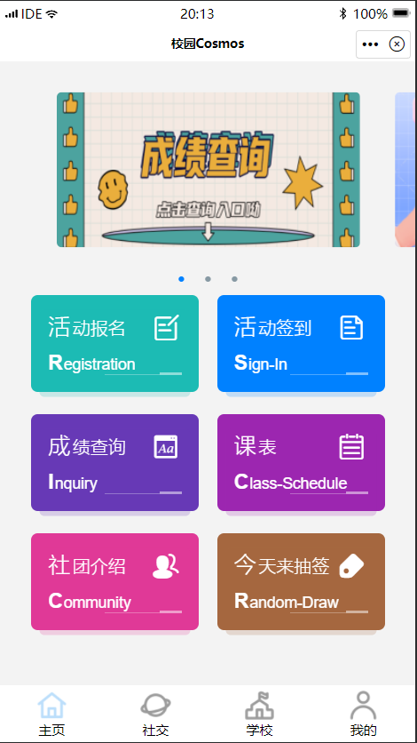
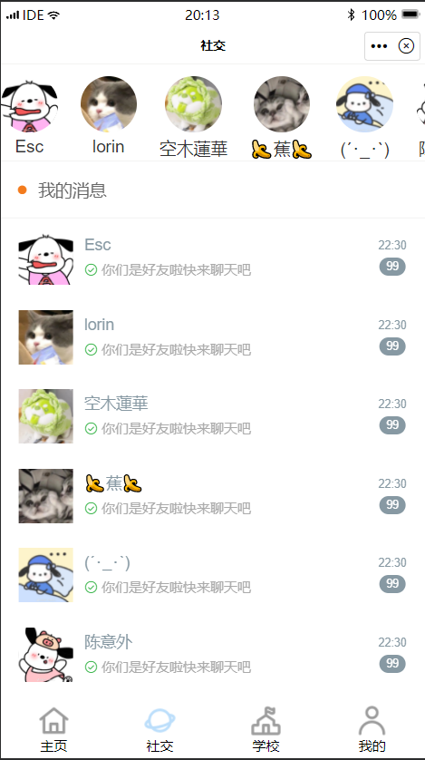
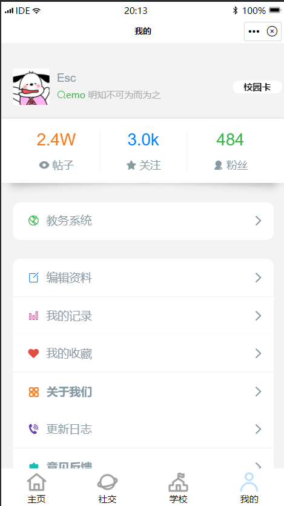

## 项目名称 - 校园Cosmos

## 团队名称 - 神级程序员重生之我在都市炒河粉

队长：叶婷婷

队员：李泽邦、李龙、邹昀昊、陈崇标

## 项目介绍

基于finclip平台的校园生活服务类小程序-校园Cosmos

### 主页板块

- 活动报名

活动发起者福音，可以填写组织报名资料发布提交。

- 活动签到

通过签到列表展现自己参加的活动，进行签到。

- 成绩查询

通过选择学期、输入学号密码查询本学期的成绩绩点

- 课表

通过选择学院班级年级，查询课表。

- 空课表生成

通过选择学院班级年级，查询空课表且生成空课表。

- 社团介绍

通过垂直列表左右标签联动实现分类查看社团

- 今天来抽签

选择困难症星人福音，可以转盘选择今天吃什么

### 社交板块

- 我的消息

与好友聊天、发图、语音

### 学校板块

- 学校地图

查看学校的地理位置

- 通讯录

通过垂直列表左右标签联动实现分类查看学校服务电话

- 问答

解决学校小知识

- 新生指南

指引新生更快融入校园

- 社区

查看校园大学生的日常帖子

### 我的板块

- 编辑资料

编辑昵称、状态、个性签名。

- 教务系统

快速登入教务系统·

- 我的记录

我的活动签到记录

- 我的收藏

我的文章收藏

- 关于我们

- 更新日志

本小程序的更新日志

- 意见反馈

通过选取满意度以及写建议提交

