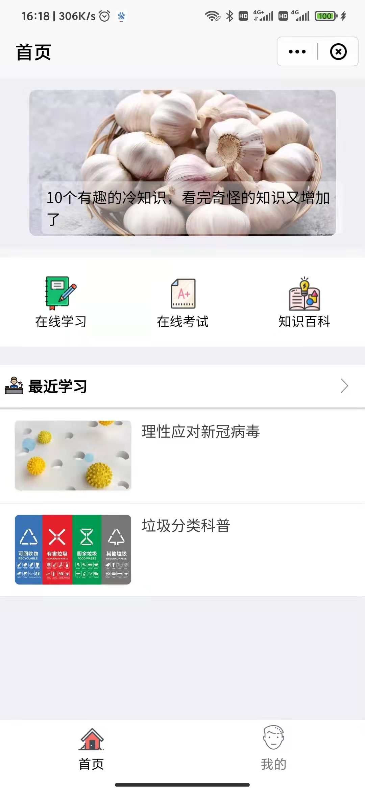
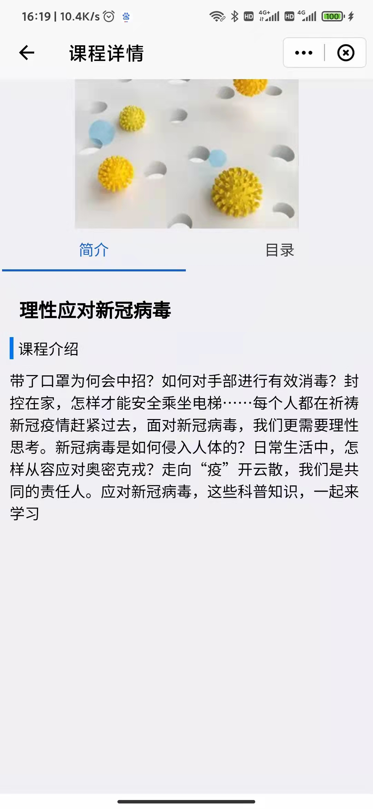
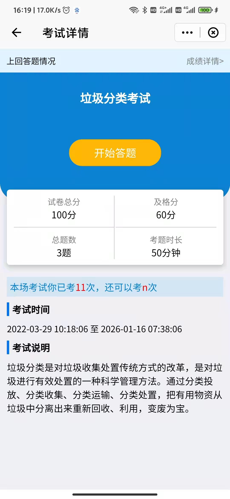
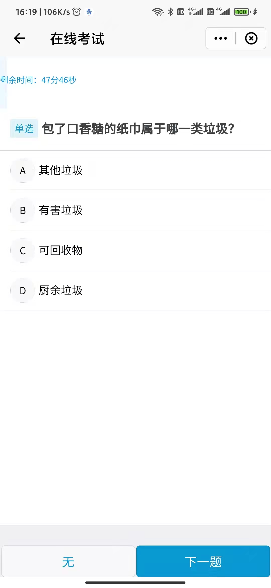
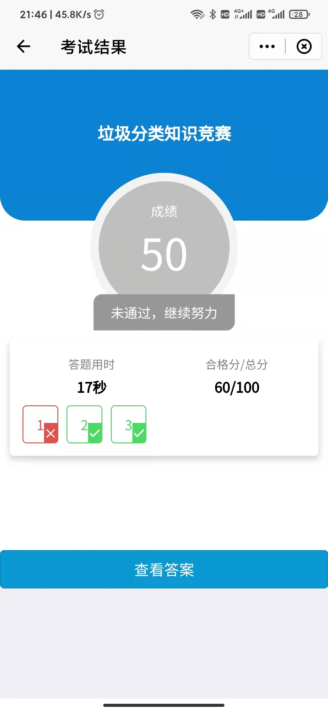

## 项目名称 - 冰云课程考试培训

## 团队名称 - 冰云

队长：林育成

队员：无

## 项目介绍

[Issue 链接](https://github.com/Michael-i/FinClip-2022-Hackthon-Challenge)

冰云课程考试培训为企业提供一个线上学习，考试的小程序  
人们可以在上面学习课程，包括课程详情，课程目录，课件等  
也可以进行考试，目前的题型有单选题，多选题，判断题，答卷后可查看分数和答案。

## 动机或背景

**背景**  
随着科技的发展，数字化为人们提供便利的生活，纸质的课程学习考试已不能满足人们的需求，一个课程考试培训小程序工具应运而出。

**解决的问题**  
课程考试培训可以实现企业聚集核心业务和产品核心价值，对企业内部人员进行培训；结合内外资源，专注新员工培训及关键岗位培训；搭建企业内训课程体系，稳定培养输出人才；除了内部培训外，对合作伙伴、客户、行业进行专业知识输出。

## 详细说明

**技术架构**  
前端：VUE，uniapp  
后端：PHP，thinkPHP  
数据库：MySql，Redis  
服务器：Linux  
  
**功能模块**  
- 登录模块  
1.用户账号注册  
2.用户账号登录  
- 首页模块  
1.轮播图展示  
2.菜单展示  
3.最近学习课程列表展示  
- 课程模块  
1.课程列表  
2.课程详情  
3.课程目录结构  
4.课件详情  
- 考试模块  
1.试卷列表  
2.试卷详情  
3.答题详情  
4.答题结果展示  

## 应用场景
**首页**  

**课程详情**  

**试卷详情**  

**答题详情**  

**答题结果** 
